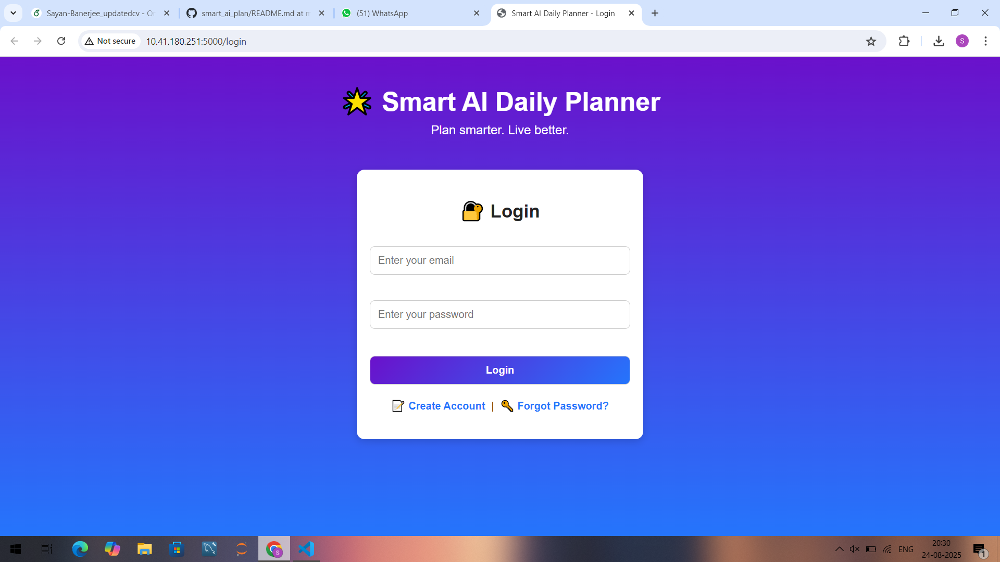
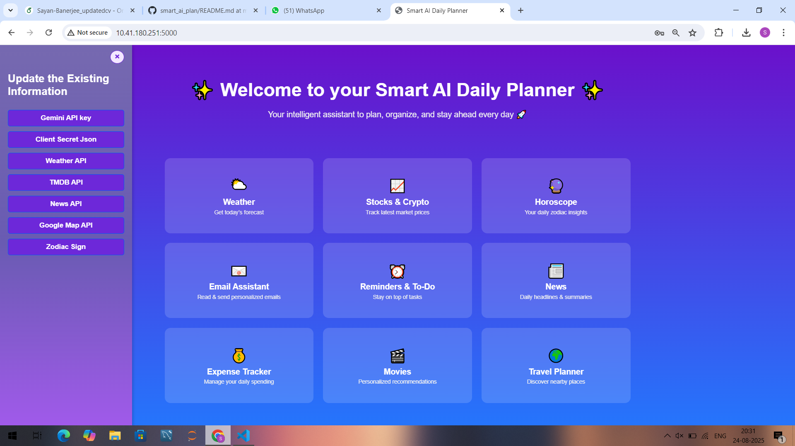
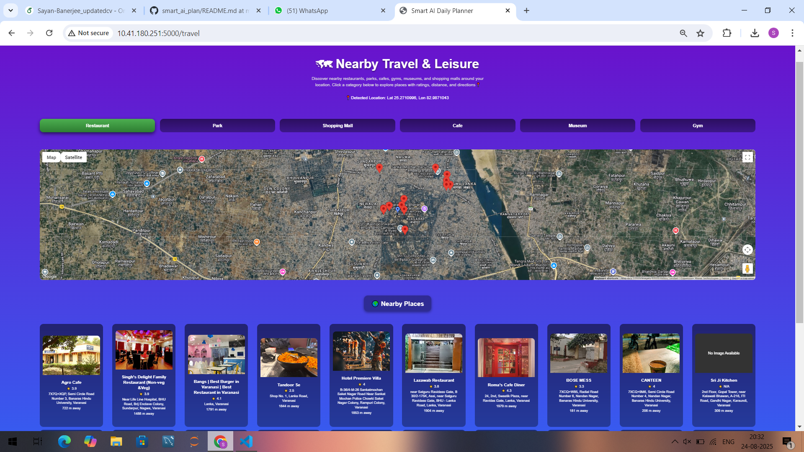

# 🌟 Smart AI Daily Planner  

A collaborative project by **Sayan Banerjee** and **Sujil S** 🚀  

The **Smart AI Daily Planner** is an all-in-one **AI-powered personal productivity assistant** that combines task management, real-time updates, and intelligent recommendations in a single platform.  

Instead of juggling multiple apps for **weather, finance, news, reminders, expenses, and entertainment**, this project integrates them all into one **seamless web application**.  
The planner is designed for busy individuals who want to:  
- **Save time** by consolidating daily utilities into one place.  
- **Stay informed** with real-time updates.  
- **Boost productivity** with automated scheduling and reminders.  
- **Personalize experiences** with AI-driven recommendations.  

Deployed on a local system 🌐 with a **beautiful frontend** and a **powerful Flask backend** ⚡.  

---

## ✨ Features  

### 📅 Productivity & Organization  
- **Google Reminders & To-Do List**  
  - Create, edit, and delete tasks with due dates.  
  - Syncs seamlessly with Google Tasks API for cross-device management.  
  - Stay on top of deadlines with a clean, minimal UI.  

- **Email Assistant**  
  - Read, summarize, and send personalized emails.  
  - Smart email drafting using Gemini LLM for professional communication.  
  - Reduces time spent writing repetitive responses.  

---

### 📊 Live Updates & Insights  
- **Weather**  
  - Get real-time weather updates and multi-day forecasts.  
  - Displays temperature, humidity, and conditions with a user-friendly UI.  

- **Stock & Crypto Updates**  
  - Live financial data for stock market and crypto trends.  
  - Visual graphs and insights to quickly understand price movements.  
  - Perfect for professionals who track investments daily.  

- **Daily News Headlines**  
  - Aggregates top headlines across categories (politics, tech, sports, etc.).  
  - Provides **yesterday’s summary** with LLM-based text summarization.  
  - Saves time by cutting through information overload.  

---

### 🔮 Lifestyle & Personalization  
- **Horoscope**  
  - Daily zodiac-based horoscope tailored to the user’s sign.  
  - Lightweight but fun feature to keep the app engaging.  

- **Expense Tracker**  
  - Simple yet powerful tool to log daily expenses.  
  - Categorization of spending (food, travel, bills, etc.).  
  - Helps maintain financial discipline and budgeting.  

- **Movie Recommendation System**  
  - AI-powered movie suggestions based on user sentiment and past preferences.  
  - Built with **custom ML logic** for personalization.  
  - Makes weekend or leisure planning easier.  

- **Travel Planner**  
  - Suggests nearby destinations based on user location.  
  - Integrates with mapping services to display travel ideas.  
  - Ideal for quick weekend getaways or local exploration.  

---

💡 **Why this project stands out**:  
Unlike typical planners, this is not just a **calendar app** — it’s a **smart assistant** that blends productivity, finance, lifestyle, and entertainment into one unified dashboard.  
It balances **work needs** (reminders, email, finance, news) with **personal needs** (movies, travel, horoscope, expenses).  

---

---

## 🛠️ Tech Stack  

- **Frontend**: HTML, CSS, Flask  
- **Backend** : Python ,Gemini LLM , Multiple APIs 
- **APIs & Services**:  
  - Weather API 🌤️  
  - News API 📰  
  - Finance APIs for Stock & Crypto 📈  
  - Google Tasks API for To-Do integration ✅  
  - Custom ML logic for movie recommendation 🎬  

---

## 🚀 Live Demo  

📹 **Video Walkthrough:** [Demo](https://drive.google.com/file/d/1cXeE-yiACutR84K9yrXqRja6Cml2YNmj/view?usp=sharing)
  

---

## 📸 Screenshots  

| Login Page | Home Screen | Movie Recommender | Travel Planner |
|------------|-------------|-------------------|----------------|
|  |  |  |  |

---

## 📜 License

This project is licensed under the MIT License – you are free to use, modify, and distribute this software with proper attribution.
See the LICENSE
 file for details.

  ## 👨‍💻 Developers  

This backend system was collaboratively developed by:  

| Developer | Profiles |
|-----------|----------|
| **Sayan Banerjee** |   |
| **Sujil S** |  

