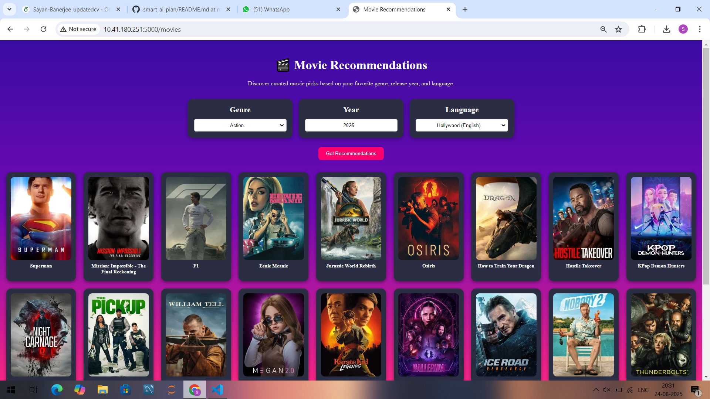

# 🌟 Smart AI Daily Planner  

A collaborative project by **Sayan Banerjee** and **Sujil S** 🚀  

The **Smart AI Daily Planner** is your all-in-one **AI-powered personal assistant** designed to make daily life seamless and organized. It integrates **productivity tools, real-time updates, and intelligent recommendations** into a single web application — helping users save time and stay informed.  

Deployed live using **Render** 🌐 with a beautiful frontend and a powerful FastAPI backend ⚡.  

---

## ✨ Features  

### 📅 Productivity & Organization  
- **Google Reminders & To-Do List** → Create, manage, and track your daily tasks effortlessly.  
- **Email Assistant** → Read and send personalized emails directly from the app.  

### 📊 Live Updates  
- **Weather** → Get current and forecasted weather conditions.  
- **Stock & Crypto** → Stay updated with market trends in real time.  
- **Daily News Headlines** → Latest updates plus a summary of the previous day.  

### 🔮 Lifestyle & Personalization  
- **Horoscope** → Daily horoscope tailored to your sign.  
- **Expense Tracker** → Simple tool to record and monitor expenses.  
- **Movie Recommendation System** → AI-based suggestions for your next movie night.  
- **Travel Planner** → Discover nearby places and travel ideas.  

---

## 🛠️ Tech Stack  

- **Frontend**: HTML, CSS, Flask  
- **Backend** : Python ,Gemini LLM , Multiple APIs 
- **APIs & Services**:  
  - Weather API 🌤️  
  - News API 📰  
  - Finance APIs for Stock & Crypto 📈  
  - Google Tasks API for To-Do integration ✅  
  - Custom ML logic for movie recommendation 🎬  

---

## 🚀 Live Demo  

📹 **Video Walkthrough:** [Demo](https://drive.google.com/file/d/1cXeE-yiACutR84K9yrXqRja6Cml2YNmj/view?usp=sharing)]  
  

---

## 📸 Screenshots  

| Homepage | Planner Dashboard | Movie Recommender |
|----------|------------------|------------------|
| .png) |  |  |

---

## 📜 License

This project is licensed under the MIT License – you are free to use, modify, and distribute this software with proper attribution.
See the LICENSE
 file for details.

## 👨‍💻 Developers  

This backend system was collaboratively developed by:  
- [Sayan Banerjee](https://github.com/your-github-username)  
- [Sujil S](https://github.com/sujil-github-username)  

